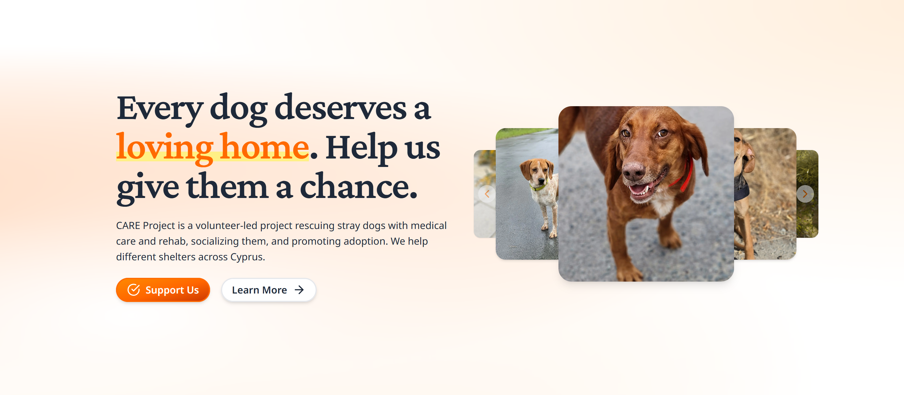

# CARE Project — Cyprus Animals Rescue Effort

[](https://opensource.org/licenses/MIT)
[](https://cloudback.it)

**A 100% volunteer-run dog rescue platform helping stray and shelter-bound dogs across Cyprus find loving homes.**

[careproject.cy](https://careproject.cy) | [UANA Foundation](https://uanafoundation.com)



## About

CARE Project is the adoption platform for [UANA Foundation](https://uanafoundation.com), a registered nonprofit in Cyprus. We rescue stray dogs, cover their veterinary care, rehabilitate and socialize them, and coordinate adoptions — locally in Cyprus and internationally to the UK, Germany, and the Netherlands.

**100% volunteer** — no paid staff, every euro goes to the animals.

## Why Open Source

Every rescue organization deserves a modern adoption platform. Most operate through social media DMs and spreadsheets. We built this site for CARE Project and are open-sourcing it so any animal rescue can fork it, add their animals, and deploy for free.

## Tech Stack

- **[Next.js](https://nextjs.org) 16** — App Router, Turbopack
- **[VaneUI](https://vaneui.com)** — React component library with boolean props API
- **[Markdoc](https://markdoc.dev)** — Markdown-based blog and pages
- **[Tailwind CSS](https://tailwindcss.com) v4** — Styling
- **[Vercel](https://vercel.com)** — Hosting and deployment (free tier)
- **[Vercel Analytics](https://vercel.com/analytics)** — Traffic insights
- **CloudFront** — Image CDN

## Features

- Dog profile pages with photos, breed, age, and adoption status
- Adoption listings filtered by availability
- Success stories gallery
- Markdown-powered blog with Cyprus-specific pet care content
- Static pages (About, Adopt, Foster, Donate, Get Involved)
- SEO-optimized with sitemap generation
- Social sharing (Open Graph, Twitter cards)
- Responsive design
- Ahrefs analytics integration

## Getting Started

### Prerequisites

- Node.js 18+
- npm

### Installation

```bash
git clone https://github.com/careproject-cy/platform.git
cd platform
npm install
```

### Development

```bash
npm run dev
```

Open [http://localhost:3000](http://localhost:3000) in your browser.

### Content Generation

Dog profiles and blog posts are stored as Markdown files in the `data/` directory. After adding or editing content, regenerate the JSON data files:

```bash
npm run generate-dogs
npm run generate-blogposts
```

### Build

```bash
npm run build
```

## Project Structure

```
careproject/
  app/
    components/       # React components (header, footer, dog cards, etc.)
    data/             # Constants and data fetching utilities
    blog/             # Blog pages
    dogs/             # Dog profile pages
    more/             # Static pages (adopt, foster, donate, etc.)
  data/
    dogs/             # Dog profiles as Markdown files
      adopted/        # Successfully adopted dogs
      germasogeia/    # Dogs from Germasogeia shelter
      mesageitonia/   # Dogs from Mesageitonia shelter
      other/          # Dogs from other locations
    blog/             # Blog posts as Markdown files
    pages/            # Static page content as Markdown
  public/             # Static assets (logos, images)
  lib/                # Data generation scripts
```

## Adding a New Dog

Create a Markdown file in the appropriate `data/dogs/` subdirectory:

```markdown
---
name: "Luna"
breed: "Mixed breed"
age: "~2 years"
gender: "Female"
status: "Available"
images:
  - "luna-1.jpg"
  - "luna-2.jpg"
---

Luna was found wandering near Limassol. She is gentle, house-trained, and loves belly rubs.
```

Then run `npm run generate-dogs` to update the data.

## Adding a Blog Post

Create a Markdown file in `data/blog/` following the naming convention `YYYY-MM-DD-slug.md`:

```markdown
---
title: "Your Post Title"
date: "2025-04-17"
description: "A brief description for SEO and previews."
image: "post-image.jpg"
---

Your blog post content here.
```

Then run `npm run generate-blogposts` to update the data.

## UANA Foundation

CARE Project operates under [UANA Foundation](https://uanafoundation.com), a registered Cyprus nonprofit (HE 442538) that supports animal rescuers across the island. UANA also runs:

- **Shelter Support** — Financial aid to municipal pounds and private rescue centers
- **Emergency Foster Program** — Temporary pet care for owners facing illness, unemployment, or domestic violence
- **Volunteer Coordination** — Organizing shelter visits, dog walks, and care activities

Contact: info@uanafoundation.com

## Contributing

We welcome contributions! Whether you're a developer, designer, or animal welfare advocate:

1. Fork the repository
2. Create a feature branch (`git checkout -b feature/your-feature`)
3. Make your changes
4. Run linting and type checks (`npm run lint && npm run typecheck`)
5. Commit your changes
6. Push to the branch (`git push origin feature/your-feature`)
7. Open a Pull Request

## Social

- Instagram: [@uana.cy](https://instagram.com/uana.cy) / [@dog_adoption_cyprus](https://instagram.com/dog_adoption_cyprus)
- Facebook: [careproject.cy](https://facebook.com/careproject.cy)
- LinkedIn: [UANA Foundation](https://linkedin.com/company/uana-foundation)
- Telegram: [care_project](https://t.me/care_project)

## License

[MIT](LICENSE) — Use this freely for your own rescue organization.
